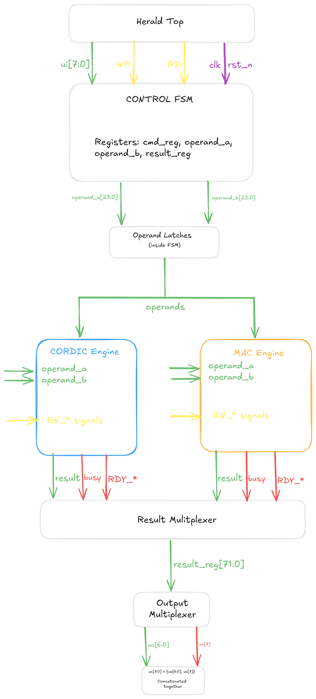
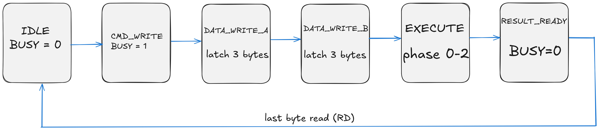

# Herald - Technical Documentation

## Overview

**Herald** is a hardware digital signal processing (DSP) accelerator that combines two computational engines:

1. **CORDIC Unit** - COordinate Rotation DIgital Computer for trigonometric operations
2. **MAC Unit** - Multiply-Accumulate unit for arithmetic operations

The design provides 8 hardware-accelerated math operations accessible through a simple serial byte-oriented interface. All computations use **Q12.12 fixed-point arithmetic** (24-bit values: 12 integer bits + 12 fractional bits).

## Architecture

Herald consists of three main components working together:

### 1. Control FSM
A finite state machine that manages the command/data protocol and orchestrates operations between the CORDIC and MAC engines. The FSM implements six states:

- **IDLE** - Waiting for command byte
- **CMD_WRITE** - Command received, ready for operands
- **DATA_WRITE_A** - Receiving first operand (3 bytes, LSB-first)
- **DATA_WRITE_B** - Receiving second operand (3 bytes, if needed)
- **EXECUTE** - Running computation (3-phase: start, wait_busy, get_result)
- **RESULT_READY** - Result available for byte-by-byte readout

### 2. CORDIC Engine (`mkCORDICHighLevel`)
Implements the CORDIC algorithm using iterative micro-rotations with only shifts and adds (no multipliers). The engine operates in two modes:

- **Rotation Mode**: Rotates a vector by a given angle (used for sin/cos)
- **Vectoring Mode**: Rotates a vector to align with x-axis (used for atan2, sqrt, normalize)

Each CORDIC operation completes in approximately 16-32 clock cycles depending on the precision required.

**Supported Operations:**
- `sin_cos(angle)` - Simultaneous sine and cosine computation
- `atan2(y, x)` - Arctangent returning angle from coordinates
- `sqrt_magnitude(x, y)` - Vector magnitude √(x² + y²)
- `normalize(x, y)` - Returns normalized unit vector plus original magnitude

### 3. MAC Engine (`mkMAC`)
A fixed-point multiply-accumulate unit with internal accumulator register. Uses Bluespec-generated multipliers optimized for hardware synthesis.

**Supported Operations:**
- `multiply(a, b)` - Simple multiplication (accumulator unchanged)
- `mac(a, b)` - Multiply-accumulate: `acc += a × b`
- `msu(a, b)` - Multiply-subtract: `acc -= a × b`
- `clear_accumulator()` - Reset accumulator to zero

### Block Diagram



> Figure 1: Herald architecture showing Control FSM, CORDIC Engine, MAC Engine, and data paths*

---

## Interface Specification

### Pin Assignment

| Pin Group | Direction | Width | Description |
|-----------|-----------|-------|-------------|
| `ui[7:0]` | Input | 8 bits | Data/command input bus |
| `uo[7:0]` | Output | 8 bits | Data output bus<br>**uo[7] = BUSY flag** |
| `uio[0]` | Input | 1 bit | **WR** - Write strobe (rising edge trigger) |
| `uio[1]` | Input | 1 bit | **RD** - Read strobe (rising edge trigger) |
| `uio[7:2]` | Unused | 6 bits | Reserved for future use |
| `clk` | Input | 1 bit | System clock (up to 50 MHz) |
| `rst_n` | Input | 1 bit | Active-low asynchronous reset |
| `ena` | Input | 1 bit | Chip enable (TinyTapeout standard) |

### Signal Descriptions

#### Input Data Bus (`ui[7:0]`)
8-bit bidirectional bus for writing command bytes and operand data. Data is latched on the rising edge of the WR strobe.

#### Output Data Bus (`uo[7:0]`)
8-bit output bus providing result data and status:
- **Bits [6:0]**: Result data (when BUSY = 0)
- **Bit [7]**: BUSY flag
  - `1` = Herald is processing a command (busy)
  - `0` = Herald is idle or result ready for reading

#### Write Strobe (`uio[0]`)
Rising edge triggers data capture from `ui[7:0]`. Used to write command bytes and operand bytes.

#### Read Strobe (`uio[1]`)
Rising edge triggers output of next result byte on `uo[7:0]`. Used to read result data byte-by-byte.

### Reset Behavior

On reset (`rst_n = 0`):
- FSM returns to IDLE state
- All registers cleared (command, operands, results)
- BUSY flag set to 0
- Output bus set to 0x00
- Both CORDIC and MAC engines reset

## Communication Protocol

Herald uses a **serial byte-oriented protocol** with write/read strobes for transferring commands, operands, and results.

### Write Sequence (Host → Herald)

**Step 1: Write Command Byte**
```
1. Set ui[7:0] = command opcode (e.g., 0x10 for SINCOS)
2. Pulse uio[0] (WR) high then low (rising edge latches data)
3. Wait 1 clock cycle
4. Check uo[7] = 1 (BUSY flag set, FSM enters CMD_WRITE state)
```

**Step 2: Write Operand Bytes**
```
For each operand byte (always LSB-first, little-endian):
1. Set ui[7:0] = data byte
2. Pulse uio[0] (WR)
3. Wait 1 clock cycle
4. Repeat for all operand bytes

Operand A: 3 bytes (bits [7:0], [15:8], [23:16])
Operand B: 3 bytes (only if command requires second operand)
```

**Step 3: Wait for Completion**
```
1. Poll uo[7] until it becomes 0
2. Herald is now in RESULT_READY state
3. Result is available for reading
```

### Read Sequence (Herald → Host)

**Step 4: Read Result Bytes**
```
For each result byte (LSB-first, little-endian):
1. Pulse uio[1] (RD)
2. Wait 1 clock cycle
3. Read uo[7:0] to get result byte
4. Repeat for all result bytes

After reading the last byte, Herald automatically returns to IDLE.
```

### Command Operand Requirements

| Command | Operand A | Operand B | Result Bytes |
|---------|-----------|-----------|--------------|
| SINCOS (0x10) | angle | - | 6 |
| ATAN2 (0x11) | y | x | 3 |
| SQRT (0x12) | x | y | 3 |
| NORMALIZE (0x13) | x | y | 9 |
| MULTIPLY (0x20) | a | b | 3 |
| MAC (0x21) | a | b | 3 |
| CLEAR (0x22) | - | - | 0 |
| MSU (0x23) | a | b | 3 |

---

## FSM State Machine

The control FSM implements the following state transitions:

```
IDLE
  ↓ (WR strobe with command byte)
CMD_WRITE
  ↓ (WR strobe with operand bytes)
DATA_WRITE_A (receive operand A, 3 bytes)
  ↓ (if command needs operand B)
DATA_WRITE_B (receive operand B, 3 bytes)
  ↓
EXECUTE (3 phases: start → wait_busy → get_result)
  ↓
RESULT_READY (output bytes on RD strobe)
  ↓ (after last byte read)
IDLE
```

### State Descriptions

**IDLE**
- Waiting for command byte
- BUSY = 0
- Transitions on WR strobe

**CMD_WRITE**
- Command byte received
- BUSY = 1
- Determines if operands needed
- CLEAR command skips directly to EXECUTE

**DATA_WRITE_A**
- Collecting first operand (3 bytes)
- Bytes stored LSB-first
- After 3rd byte, checks if operand B needed

**DATA_WRITE_B**
- Collecting second operand (3 bytes)
- Only for commands requiring two operands
- After 3rd byte, transitions to EXECUTE

**EXECUTE**
- Three-phase execution:
  - **Phase 0**: Assert start enable signal to CORDIC or MAC
  - **Phase 1**: Wait for engine busy flag to clear
  - **Phase 2**: Assert get_result enable and latch result
- Transitions to RESULT_READY when result captured

**RESULT_READY**
- Result available for reading
- BUSY = 0
- Each RD strobe outputs next byte
- Returns to IDLE after last byte read

### State Diagram



> Figure 2: FSM state transitions for command processing*

---

## Data Format: Q12.12 Fixed-Point

All operands and results use **24-bit Q12.12 fixed-point** representation:

```
Bit Layout:
[23]     [22:12]      [11:0]
Sign     Integer      Fractional
1 bit    11 bits      12 bits
```

### Format Details

- **Sign bit [23]**: 0 = positive, 1 = negative (two's complement)
- **Integer bits [22:12]**: Signed integer part (range: -2048 to +2047)
- **Fractional bits [11:0]**: Unsigned fractional part (units of 1/4096)

### Numeric Range and Resolution

- **Range**: -2048.0 to +2047.999755859375
- **Resolution**: 1/4096 ≈ 0.000244140625
- **Smallest positive value**: 0x000001 = 1/4096
- **Largest positive value**: 0x7FFFFF ≈ 2047.9998
- **Most negative value**: 0x800000 = -2048.0

### Encoding Examples

| Decimal Value | Hex (Q12.12) | Binary Breakdown |
|---------------|--------------|------------------|
| 0.0 | 0x000000 | 0 00000000000 000000000000 |
| 1.0 | 0x001000 | 0 00000000001 000000000000 |
| 0.5 | 0x000800 | 0 00000000000 100000000000 |
| -1.0 | 0xFFF000 | 1 11111111111 000000000000 |
| 3.14159 | 0x003243 | 0 00000000011 001001000011 |
| π/2 (1.5708) | 0x001921 | 0 00000000001 100100100001 |
| -0.25 | 0xFFFC00 | 1 11111111111 110000000000 |

### Conversion Functions

**Floating-point to Q12.12:**
```c
int32_t float_to_q12_12(float value) {
    return (int32_t)(value * 4096.0f);
}
```

**Q12.12 to floating-point:**
```c
float q12_12_to_float(int32_t q_value) {
    return (float)q_value / 4096.0f;
}
```

### Byte Order (Endianness)

All multi-byte values are transmitted **LSB-first (little-endian)**:
- **Byte 0**: Bits [7:0] (least significant)
- **Byte 1**: Bits [15:8]
- **Byte 2**: Bits [23:16] (most significant)

**Example**: Value 0x003243 (π ≈ 3.14159) is transmitted as:
```
Byte 0: 0x43
Byte 1: 0x32
Byte 2: 0x00
```

## Command Reference

### CORDIC Commands

#### 0x10: CORDIC_SINCOS
**Compute sine and cosine of an angle simultaneously**

**Operands:**
- `angle` (3 bytes, Q12.12, radians)

**Result:** 6 bytes
- Bytes 0-2: `sin(angle)` (Q12.12)
- Bytes 3-5: `cos(angle)` (Q12.12)

**Range:** Input angle should be in range [-π, +π] for best accuracy. Values outside this range will wrap.

**Example:**
```
Input:  angle = π/4 ≈ 0.7854 = 0x000C91
Output: sin = 0.707 ≈ 0x000B50
        cos = 0.707 ≈ 0x000B50
```

#### 0x11: CORDIC_ATAN2
**Compute arctangent of y/x (angle from coordinates)**

**Operands:**
- `y` (3 bytes, Q12.12)
- `x` (3 bytes, Q12.12)

**Result:** 3 bytes
- Angle in radians (Q12.12), range [-π, +π]

**Special Cases:**
- If x = 0 and y > 0: returns +π/2
- If x = 0 and y < 0: returns -π/2
- If x = 0 and y = 0: returns 0

**Example:**
```
Input:  y = 1.0 = 0x001000
        x = 1.0 = 0x001000
Output: angle = π/4 ≈ 0.7854 = 0x000C91
```

#### 0x12: CORDIC_SQRT
**Compute magnitude of vector (x, y) using √(x² + y²)**

**Operands:**
- `x` (3 bytes, Q12.12)
- `y` (3 bytes, Q12.12)

**Result:** 3 bytes
- Magnitude (Q12.12)

**Note:** Both x and y are squared internally, so sign doesn't affect result. This is effectively computing the Euclidean distance from origin.

**Example:**
```
Input:  x = 3.0 = 0x003000
        y = 4.0 = 0x004000
Output: magnitude = 5.0 = 0x005000
```

#### 0x13: CORDIC_NORMALIZE
**Normalize vector and return both normalized components plus magnitude**

**Operands:**
- `x` (3 bytes, Q12.12)
- `y` (3 bytes, Q12.12)

**Result:** 9 bytes
- Bytes 0-2: `x_normalized` (Q12.12, unit vector x-component)
- Bytes 3-5: `y_normalized` (Q12.12, unit vector y-component)
- Bytes 6-8: `magnitude` (Q12.12, original vector length)

**Properties:**
- x_normalized² + y_normalized² ≈ 1.0
- x = x_normalized × magnitude
- y = y_normalized × magnitude

**Example:**
```
Input:  x = 3.0 = 0x003000
        y = 4.0 = 0x004000
Output: x_norm = 0.6 = 0x000999
        y_norm = 0.8 = 0x000CCD
        magnitude = 5.0 = 0x005000
```

### MAC Commands

#### 0x20: MAC_MULTIPLY
**Simple fixed-point multiplication: result = a × b**

**Operands:**
- `a` (3 bytes, Q12.12)
- `b` (3 bytes, Q12.12)

**Result:** 3 bytes
- Product `a × b` (Q12.12)

**Note:** Internal accumulator is **not affected** by this operation.

**Example:**
```
Input:  a = 2.5 = 0x002800
        b = 1.5 = 0x001800
Output: result = 3.75 = 0x003C00
```

#### 0x21: MAC_MAC
**Multiply-accumulate: accumulator += a × b**

**Operands:**
- `a` (3 bytes, Q12.12)
- `b` (3 bytes, Q12.12)

**Result:** 3 bytes
- New accumulator value (Q12.12)

**Operation:** 
```
accumulator = accumulator + (a × b)
return accumulator
```

**Use Cases:**
- Dot products: Σ(aᵢ × bᵢ)
- FIR filters: Σ(coeffᵢ × sampleᵢ)
- Matrix multiplication

**Example (accumulator starts at 0):**
```
Call 1: a = 1.0, b = 2.0 → acc = 2.0 = 0x002000
Call 2: a = 3.0, b = 1.0 → acc = 5.0 = 0x005000
Call 3: a = 0.5, b = 4.0 → acc = 7.0 = 0x007000
```

#### 0x22: MAC_CLEAR
**Clear accumulator to zero**

**Operands:** None

**Result:** None (returns to IDLE immediately)

**Operation:**
```
accumulator = 0
```

**Use Cases:**
- Reset before new MAC sequence
- Initialize for new computation

**Example:**
```
Write: CMD = 0x22
(No operands written, no result read, Herald returns to IDLE)
```

#### 0x23: MAC_MSU
**Multiply-subtract: accumulator -= a × b**

**Operands:**
- `a` (3 bytes, Q12.12)
- `b` (3 bytes, Q12.12)

**Result:** 3 bytes
- New accumulator value (Q12.12)

**Operation:**
```
accumulator = accumulator - (a × b)
return accumulator
```

**Use Cases:**
- Error correction algorithms
- Adaptive filters
- Subtractive synthesis

**Example (accumulator = 10.0):**
```
Input:  a = 2.0 = 0x002000
        b = 1.5 = 0x001800
Output: acc = 10.0 - 3.0 = 7.0 = 0x007000
```

## Testing and Verification

Herald includes comprehensive cocotb testbenches covering:

### Protocol Tests (`test_wrapper.py`)
- Command write sequences
- Operand byte ordering
- BUSY flag behavior
- Result readback
- FSM state transitions

### CORDIC Tests (`test_cordic.py`)
- Trigonometric accuracy (sin/cos)
- Angle calculation (atan2)
- Magnitude computation (sqrt)
- Vector normalization
- Edge cases (zero vectors, negative values)

### MAC Tests (`test_mac.py`)
- Multiplication accuracy
- Accumulator operations
- Overflow behavior
- Clear functionality
- Multi-step accumulation

## Design Notes

### CORDIC Algorithm Implementation

The CORDIC engine uses a table of pre-computed arctangent values for each iteration:
```
atan(2^-i) for i = 0, 1, 2, ..., 23
```

Each iteration performs:
```
x_new = x - y × d × 2^(-i)
y_new = y + x × d × 2^(-i)
z_new = z - d × atan(2^(-i))
```

where `d ∈ {-1, +1}` is the rotation direction determined by the sign of the remaining angle.

### Fixed-Point Multiplication

MAC operations multiply two Q12.12 values:
```
Q12.12 × Q12.12 → Q24.24 (48-bit intermediate)
Shift right 12 bits → Q12.12 (24-bit result)
```

The Bluespec-generated multiplier handles this automatically with proper rounding.

### Clock Domain

All operations are fully synchronous to the input clock. No internal clock generation or clock domain crossings.

### Reset Strategy

Asynchronous reset (`rst_n`) for reliable startup. All registers have defined reset values.